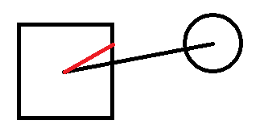
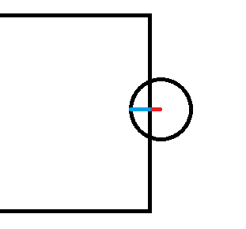
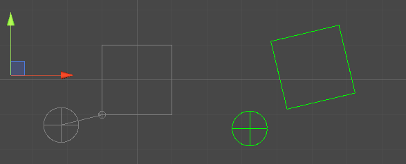
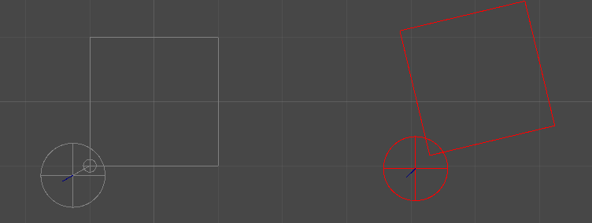
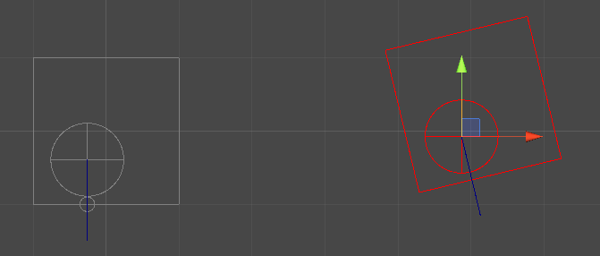

# Circle-Square Collision Test in 2D

The circle square collision test is actually relatively simple to compute. Let's start with an axis aligned square. With an axis aligned square, it's easy. We just have to project the center of the circle onto the surface of the square. We can do this by computing the vector between the center of the circle, and the center of the square. We then clamp the x and y components of this vector to be within the square.


In the above example, the black line represents the vector from the square to the circle. The vector's t component is within the height of the square, however the x component is much greater than the right most wall of the square. Therefore we clamp the x value, and the resulting vector is shown in red.

This works for any angle, and those familiar with projection will be familiar with the clamping method. So now we have the projected point on the square, which is by definition the closest point on the square to the circle's center. From here it's trivial to find the distance function. Simply find the length of the vector from the projected point to the circle's center, then subtract the circle's radius. If the distance is less than 0 then we are colliding! Now let's try putting this into code! We'll come back to the case of a non axis aligned box in a moment. We're also going to assume for simplicity that this box is at the origin.

For the following code examples we'll assume the following variables:
```csharp
public struct Square {
  public Vector2 position;
  public float width;
  public float height;
}

public struct Circle {
  public Vector2 position;
  public float radius;
}

var square = new Square();
var circle = new Circle();
```
We'll also assume your y axis is positive in the up direction, and x axis positive in the right direction.

Given a axis aligned box centered at the origin, there's a very nice and simple formula for projecting the circle onto the square:
```csharp
Vector2 projection = new Vector2();
projection.x = Mathf.Max(-square.width / 2, Mathf.Min(circle.position.x, square.width / 2));
projection.y = Mathf.Max(-square.height / 2, Mathf.Min(circle.position.y, square.height / 2));
```

This may look a bit confusing at first but let's break it down. Start with the `Mathf.Min(circle.position.x, square.width / 2)`. This is just taking the smallest between `circle.position.x` and  `square.position + square.width / 2`. Since we're assuming the square's position is the origin for now, the right wall of the square is positioned at `square.width / 2`. Therefore we get our final formula `Mathf.Min(circle.position.x, square.width / 2)`. The result of this function is if the circle is to the right of the square's right wall (x is greater than the x of the right wall) then it will just take the position of the wall. So now we've clamped any x values farther right of the square, to the square. But what if we're further left of the square? Well in that case, the circle's x position will be less than the right wall of the square, and our Min function will return the circle's position. Now we just take the max of circle's x position with the position of the left wall of the square. We're just doing the same check, but with a Max function now instead, since we want to only clamp if the circle's x position is smaller than the left wall of the square. Now we get our final formula! Just repeat for the y axis and we've successfully done a projection in 2 lines of code, with very minimal computation time!

Our delta vector is now simply
```csharp
Vector2 delta = circle.position - projection;
```

Now just check the length of this vector minus the circle radius to determine the distance!
```csharp
float distance = delta.magnitude - circle.radius;
```

One thing we should note is the magnitude calculation requires performing a square root, which often uses numerical aproximation. This is not a very efficient operation. However, we can abuse the fact that the squares of two values are proportional. In other words, if `a > b`, then `a^2 > b^2` and vice versa. Thus we can compare the squares first and make sure the objects are actually colliding, before performing more heavy operations to extract information. A generally good idea is to perform the cheapest check possible to determine if two objects are colliding, then extract more information from them. This is pretty simple in this example, but may become a balancing act later on. For example, one can posit an algorithm that is very very cheap for determining whether an object is colliding, but provides no information about the collision. Thus we'd need to run another collision detection algorithm that will provide that information after the first algorithm says there's a collision. In which case we would have to look closely if on average it would be faster to just run the algorithm that provides collision info from the start. But for our current case, we already have all the info we need if the collision check passes, so we can just do the following to exit early:
```csharp
#define EPS 0.00001f
if (delta.sqrMagnitude >= circle.radius * circle.radius - EPS) return false;
float distance = delta.magnitude - circle.radius;
```
We use an EPS value to help prevent odd interactions with floating point error. For example if we resolve the collision so the distance is exactly 0, floating point error may still say there's a collision.

Next we'll want to extract some information about the collision for our solver. Depending on whether or not we're using discrete or continuous collision, here's some values we may want.

The minimum translation vector is the vector the circle must be moved to resolve the collision. Now depending on the mass of the two bodies, this vector may be split between the two. But for now we only need to think about the circle. We can compute this very easily, It's simply the delta vector, with length `circle.radius - delta.magnitude`. This is because part of the circle is penetrating and we're interested in the part that's not outside the circle.


The red line above represents the delta vector, the blue line is what our minimum translation vector is. Notice how the sum of those two lengths is the radius? And they're both in the direction of our delta vector? So our final formula is
```csharp
Vector2 mtv = delta.normalized * (circle.radius - delta.magnitude);
```

Our normal to the collision is simply delta normalized
```csharp
Vector2 normal = delta.normalized;
```
The logic here is simply because our minimum translation vector is the normal, and our delta is in the same direction, therefore we can just do this. It might be more efficient to compute this first, then use our normal vector in the above equation for mtv.
```csharp
Vector2 normal = delta.normalized;
Vector2 mtv = normal * (circle.radius - delta.magnitude);
```
For our point of collision, it will be positioned at the result of our minimum translation. Which in this case is the projected point on the square.
```csharp
Vector2 pointOfCollision = projection;
```

Great! Now that we've determined all that information, we should talk about what happens when the square isn't axis aligned, or at the origin. Simple. Translate everything to the origin and rotate it. Now we can perform everything we've done up until now without a worry. Make sure you translate all your results back to the original space when you're done. Your normal, mtv, etc will all be in local space of the square. So you'll have to do the inverse. To translate a point / vector to the square space, simply do the following:
```csharp
// Assume we now have square.rotation which is a float of the z rotation in radians
Circle relativeCircle = circle; // Since this is a struct, it's pass by value
relativeCircle.position -= square.position; // Move the circle relative to the square
Circle localCircle = relativeCircle;
float cs = Mathf.Cos(-square.rotation); // -rotation because we're undoing the rotation
float sn = Mathf.Sin(-square.rotation);
// Note it's important to have seperate variables, because if we set relative.position.x then the next line
// which sets position y would be wrong. So we use two seperate variables to avoid this
localCircle.position.x = cs * relativeCircle.position.x - sn * relativeCircle.position.y;
localCircle.position.y = sn * relativeCircle.position.x + cs * relativeCircle.position.y;
```
Now just use everything we had before, except with the localCircle. This can be made much more memory efficient, but i'll leave that up to you. I wrote it the way i did to make the core concepts more understandable. Not necessarily to be the most efficient.

Here's what the unity example looks like, showing you the local position of the objects in grey, the delta vector and translation point also in grey, and the mtv in blue.



To translate your results back, first rotate, replacing `-square.rotation` with `square.rotation`. Then, and only after rotating, translate back by adding the square's position to your results. It's important to remember your vector results like your normal, and mtv, do not need translating since they are vectors, not points. However your collision point will need to be translated back.

Ok, one LAST little detail. What happens when the circle's center is INSIDE the box? Well our delta vector will just be a 0 length vector that is the center of the circle. That won't do. How are we supposed to get our mtv? In this case we swap out our algorithm. First check if the circle's center is inside the square:
```csharp
bool inside = localCircle.position.x < square.width / 2;
inside &= localCircle.position.x > -square.width / 2;
inside &= localCircle.position.y < square.height / 2;
inside &= localCircle.position.y > -square.height / 2;
```
If we're inside, just compute the distance to each wall of the square, and pick the shortest distance. Your delta now becomes that closest point. I won't write code for this, as it's just a bunch of if statements. But here's a visual example:


The blue line is once again your mtv. This is now your delta vector + the size of the radius so it leaves the square completely.
```csharp
if (inside) {
  mtv = delta + delta.normalized * circle.radius;
}
```

That pretty much wraps it up. With this you should now have a efficient distance function that can be used for continuous collision, as well as all the data you need for discrete collision testing!
